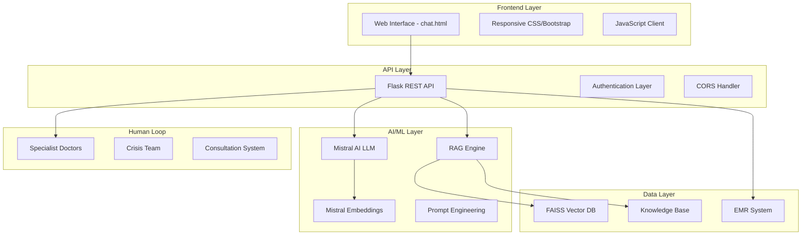
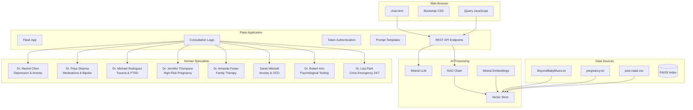
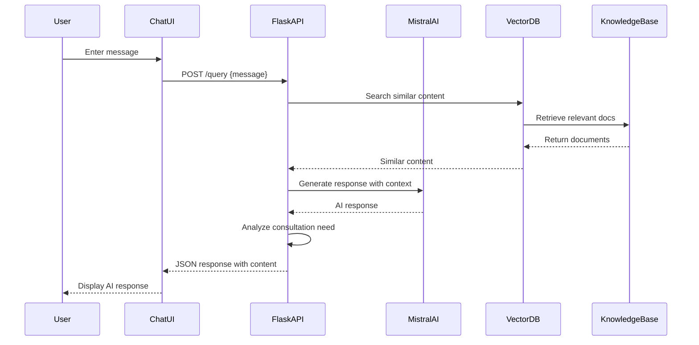
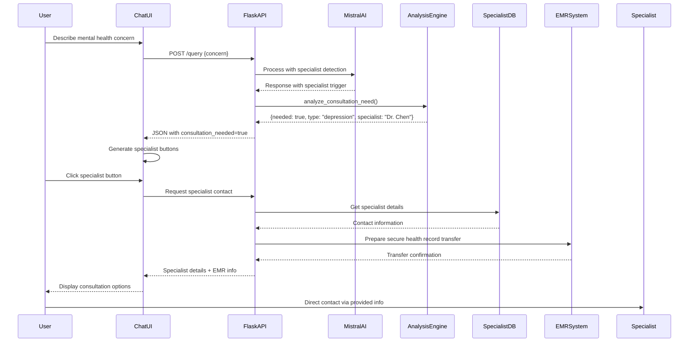
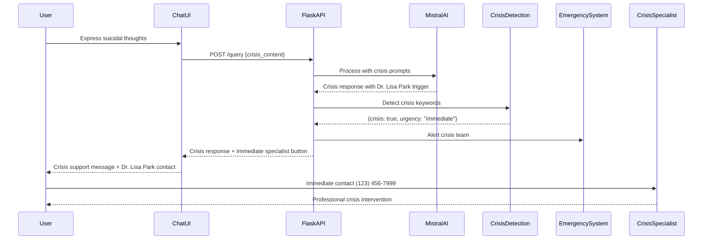

# BeyondBabyBlues - Developer Documentation

## Table of Contents
1. [Project Overview](#project-overview)
2. [Architecture Overview](#architecture-overview)
3. [Technology Stack](#technology-stack)
4. [System Components](#system-components)
5. [Component Diagram](#component-diagram)
6. [Sequence Diagrams](#sequence-diagrams)
7. [API Documentation](#api-documentation)
8. [Database Schema](#database-schema)
9. [Human-in-the-Loop System](#human-in-the-loop-system)
10. [Security & HIPAA Compliance](#security--hipaa-compliance)
11. [Development Setup](#development-setup)
12. [Deployment Guide](#deployment-guide)
13. [Testing Strategy](#testing-strategy)
14. [Troubleshooting](#troubleshooting)

## Project Overview

BeyondBabyBlues is an AI-powered postpartum depression support system that combines artificial intelligence with human specialist intervention. The system provides immediate support through an AI chatbot and seamlessly escalates to human specialists when complex mental health situations require professional judgment.

### Key Features
- **AI-Powered Support**: Mistral AI-based chatbot for immediate assistance
- **Human-in-the-Loop**: Intelligent escalation to specialist doctors
- **HIPAA Compliance**: Secure health record management and transfer
- **Specialist Matching**: Context-aware specialist recommendations
- **Crisis Intervention**: 24/7 emergency support system
- **Multi-Modal Interface**: Web-based chat interface with responsive design

## Architecture Overview

The system follows a microservices-inspired architecture with clear separation of concerns:



## Technology Stack

### Backend Technologies
- **Framework**: Flask 2.3+
- **API Documentation**: Flask-RESTX (Swagger/OpenAPI)
- **AI/ML**: 
  - Mistral AI (mistral-large-latest)
  - LangChain Community
  - FAISS (Facebook AI Similarity Search)
- **Security**: CORS, Environment Variables, Token Authentication
- **Data Processing**: Pandas, NumPy
- **Logging**: Python logging, Colorama

### Frontend Technologies
- **HTML5**: Semantic markup
- **CSS3**: Bootstrap 5.3+, Custom CSS variables
- **JavaScript**: jQuery 3.6+, ES6+
- **Icons**: Font Awesome 6.6+
- **Responsive Design**: Mobile-first approach

### Infrastructure & DevOps
- **Environment**: Python 3.11+
- **Virtual Environment**: venv
- **Package Management**: pip
- **Configuration**: .env files
- **Logging**: File-based logging (myapp.log)

### Third-Party Services
- **Mistral AI**: LLM and Embeddings API
- **Email Systems**: SMTP for specialist notifications
- **EMR Integration**: HIPAA-compliant health record system

## System Components

### 1. Core Application Files

```
rag_medical-main/
├── rag_medical_mistral.py      # Main Flask application (Mistral-based)
├── rag_medical.py              # Alternative Azure OpenAI version
├── faiss_lib_mistral.py        # Mistral-specific library functions
├── faiss_lib.py                # General FAISS operations
├── chat.html                   # Web interface
├── requirements_mistral.txt    # Python dependencies (Mistral)
├── .env                        # Environment configuration
└── myapp.log                   # Application logs
```

### 2. Data & Knowledge Base

```
datasets/
├── BeyondBabyBlues.txt        # Company & specialist information
├── pregnancy.txt              # Medical knowledge base
└── post-natal.csv             # Postpartum care data

medical_faiss_index_mistral/
├── index.faiss                # Vector embeddings index
└── index.pkl                  # Metadata storage
```

### 3. Documentation

```
├── README_MISTRAL.md          # Mistral implementation guide
├── MIGRATION_GUIDE.md         # Migration instructions
├── DEVELOPER.md               # This file
└── test_mistral.py            # Test scripts
```

## Component Diagram



## Sequence Diagrams

### 1. Standard AI Interaction Flow



### 2. Human-in-the-Loop Escalation Flow



### 3. Crisis Intervention Flow



## API Documentation

### Base URL
```
http://localhost:5000
```

### Authentication
Currently uses token-based authentication (commented out in development):
```
Authorization: 111-1111-11111
```

### Endpoints

#### POST /query
Execute RAG query with specialist consultation detection.

**Request:**
```json
{
  "query": "I'm feeling really depressed after having my baby"
}
```

**Response:**
```json
{
  "role": "assistant",
  "content": "<HTML formatted response>",
  "sources": ["source1", "source2"],
  "consultation_needed": true,
  "consultation_type": "depression",
  "recommended_specialist": "Dr. Rachel Chen - Depression & Anxiety"
}
```

**Status Codes:**
- `200`: Success
- `403`: Invalid token (when authentication enabled)
- `500`: Server error

#### GET /swagger
Interactive API documentation via Swagger UI.

### Response Format

All API responses follow this structure:
```json
{
  "role": "assistant",
  "content": "HTML formatted response content",
  "sources": ["array of source references"],
  "consultation_needed": boolean,
  "consultation_type": "crisis|depression|anxiety|trauma|medication|high_risk|family|general",
  "recommended_specialist": "specialist name and specialization"
}
```

## Database Schema

### FAISS Vector Database Structure

```
medical_faiss_index_mistral/
├── index.faiss          # Vector embeddings (768-dimensional)
└── index.pkl            # Metadata and document mappings
```

**Document Types Stored:**
- Company information (BeyondBabyBlues.txt)
- Medical knowledge (pregnancy.txt)
- Postpartum care data (post-natal.csv)

**Embedding Model:** 
- `mistral-embed` (768 dimensions)
- Batch processing with 500 document chunks per batch

### Knowledge Base Structure

#### BeyondBabyBlues.txt
```
- Company overview and mission
- Services offered (7 main services)
- 8 specialist doctors with full contact details
- EMR system information
- HIPAA compliance details
- Contact information and working hours
```

#### pregnancy.txt
```
- General pregnancy information
- Medical guidelines and advice
- Prenatal and postpartum care
```

#### post-natal.csv
```
- Structured postpartum care data
- CSV format for easy data processing
- Medical recommendations and guidelines
```

## Human-in-the-Loop System

### Specialist Database

The system maintains detailed information about 8 specialists:

| Specialist | Specialization | Phone | Email | Availability |
|------------|---------------|-------|-------|---------------|
| Dr. Rachel Chen | Depression & Anxiety | (123) 456-7891 | dr.chen@BeyondBabyBlues.com | Mon-Fri 9-6 |
| Dr. Priya Sharma | Medications & Bipolar | (123) 456-7892 | dr.sharma@BeyondBabyBlues.com | Tue-Sat 8-5 |
| Dr. Michael Rodriguez | Trauma & PTSD | (123) 456-7893 | dr.rodriguez@BeyondBabyBlues.com | Mon-Thu 10-7 |
| Dr. Jennifer Thompson | High-Risk Pregnancy | (123) 456-7894 | dr.thompson@BeyondBabyBlues.com | Mon-Fri 7-4 |
| Dr. Amanda Foster | Family Therapy | (123) 456-7895 | amanda.foster@BeyondBabyBlues.com | Various |
| Sarah Mitchell | Anxiety & OCD | (123) 456-7896 | sarah.mitchell@BeyondBabyBlues.com | Various |
| Dr. Robert Kim | Psychological Testing | (123) 456-7897 | dr.kim@BeyondBabyBlues.com | Various |
| Dr. Lisa Park | Crisis Emergency | (123) 456-7999 | crisis@BeyondBabyBlues.com | 24/7 |

### Consultation Matching Logic

```python
def analyze_consultation_need(response_content):
    # Crisis situations → Dr. Lisa Park
    # Depression/Mood → Dr. Rachel Chen or Dr. Priya Sharma  
    # Anxiety → Sarah Mitchell or Dr. Rachel Chen
    # Trauma/PTSD → Dr. Michael Rodriguez
    # Medications → Dr. Priya Sharma
    # High-risk pregnancy → Dr. Jennifer Thompson
    # Family issues → Dr. Amanda Foster
    # Psychological testing → Dr. Robert Kim
```

### EMR Integration

**BeyondBabyBlues Secure Health Portal (BBSHP)**
- HIPAA-compliant health record system
- AES-256 encryption for data transfer
- Multi-factor authentication
- Complete audit trails
- Patient portal access: portal.BeyondBabyBlues.com

## Security & HIPAA Compliance

### Data Protection
- **Encryption**: AES-256 encryption for all health records
- **Access Control**: Role-based access with MFA
- **Audit Trails**: Complete logging of all EMR access
- **Session Management**: Automatic timeouts and secure sessions

### HIPAA Compliance Features
- Patient consent management for specialist consultations
- Encrypted data transfer between systems
- Secure specialist portal access
- Privacy officer contact: privacy@BeyondBabyBlues.com
- Data retention policies (minimum 6 years)

### Authentication & Authorization
```python
# Token-based authentication (currently disabled for development)
SYSTEM_TOKEN = "111-1111-11111"

# CORS enabled for cross-origin requests
CORS(app)
```

## Development Setup

### Prerequisites
- Python 3.11+
- Virtual environment support
- Mistral AI API key

### Installation Steps

1. **Clone the repository:**
```bash
git clone <repository-url>
cd rag_medical-main
```

2. **Create virtual environment:**
```bash
python -m venv .venv
.venv\Scripts\Activate.ps1  # Windows PowerShell
# or
source .venv/bin/activate   # Linux/Mac
```

3. **Install dependencies:**
```bash
pip install -r requirements_mistral.txt
```

4. **Environment configuration:**
Create `.env` file:
```
MISTRAL_API_KEY=your_mistral_api_key_here
```

5. **Initialize FAISS index:**
```bash
python rag_medical_mistral.py
```

### Project Structure
```
rag_medical-main/
├── .venv/                      # Virtual environment
├── datasets/                   # Knowledge base files
│   ├── BeyondBabyBlues.txt
│   ├── pregnancy.txt
│   └── post-natal.csv
├── medical_faiss_index_mistral/ # Vector database
├── __pycache__/               # Python cache
├── rag_medical_mistral.py     # Main application
├── faiss_lib_mistral.py       # Library functions
├── chat.html                  # Frontend interface
├── requirements_mistral.txt   # Dependencies
├── .env                       # Environment variables
├── myapp.log                  # Application logs
└── DEVELOPER.md               # This documentation
```

## Deployment Guide

### Local Development
```bash
# Start the application
python rag_medical_mistral.py

# Access the application
# API: http://localhost:5000
# Swagger: http://localhost:5000/swagger
# Chat Interface: Open chat.html in browser
```

### Production Deployment

1. **Environment Setup:**
```bash
# Production environment variables
export MISTRAL_API_KEY=production_api_key
export FLASK_ENV=production
export FLASK_DEBUG=False
```

2. **WSGI Server (Gunicorn):**
```bash
pip install gunicorn
gunicorn -w 4 -b 0.0.0.0:5000 rag_medical_mistral:app
```

3. **Web Server (Nginx) Configuration:**
```nginx
server {
    listen 80;
    server_name your-domain.com;
    
    location / {
        proxy_pass http://127.0.0.1:5000;
        proxy_set_header Host $host;
        proxy_set_header X-Real-IP $remote_addr;
    }
}
```

### Docker Deployment (Optional)

```dockerfile
FROM python:3.11-slim

WORKDIR /app
COPY requirements_mistral.txt .
RUN pip install -r requirements_mistral.txt

COPY . .
EXPOSE 5000

CMD ["python", "rag_medical_mistral.py"]
```

## Testing Strategy

### Manual Testing
```bash
# Test the Mistral implementation
python test_mistral.py
```

### API Testing
```bash
# Test API endpoint with curl
curl -X POST http://localhost:5000/query \
  -H "Content-Type: application/json" \
  -d '{"query": "I am feeling depressed after childbirth"}'
```

### Frontend Testing
1. Open `chat.html` in browser
2. Test different conversation flows:
   - General questions
   - Depression-related queries
   - Crisis situations
   - Specialist consultations

### Integration Testing
- Test AI response generation
- Verify specialist matching logic
- Validate FAISS vector search
- Check EMR integration flows

## Troubleshooting

### Common Issues

#### 1. MISTRAL_API_KEY not found
```bash
# Solution: Check .env file exists and contains API key
echo "MISTRAL_API_KEY=your_key_here" > .env
```

#### 2. FAISS index not found
```bash
# Solution: Initialize the FAISS index
python rag_medical_mistral.py
# Look for "QA Chain initialized successfully!" message
```

#### 3. Import errors for langchain-community
```bash
# Solution: Install the correct packages
pip install langchain-community markdown
```

#### 4. Chat interface not connecting to API
```javascript
// Check API URL in chat.html
url: 'http://localhost:5000/query'
// Ensure Flask app is running on port 5000
```

#### 5. Specialist buttons not showing
- Check LLM response for trigger phrases
- Verify `analyze_consultation_need()` function
- Ensure specialist database is synchronized

### Debug Mode
Enable debug logging by modifying the Flask app:
```python
app.run(host='localhost', port=5000, debug=True)
```

### Log Analysis
Check application logs:
```bash
tail -f myapp.log
```

### Performance Monitoring
- Monitor response times in browser developer tools
- Check FAISS index size and search performance
- Monitor API endpoint response times

## Contributing

### Code Style
- Follow PEP 8 for Python code
- Use meaningful variable names
- Add docstrings for functions
- Comment complex logic

### Git Workflow
1. Create feature branch
2. Make changes with descriptive commits
3. Test thoroughly
4. Submit pull request

### Documentation Updates
- Update this DEVELOPER.md for architectural changes
- Update README_MISTRAL.md for user-facing changes
- Update API documentation for endpoint changes

---

**Last Updated:** October 4, 2025  
**Version:** 1.0.0  
**Maintainer:** BeyondBabyBlues Development Team